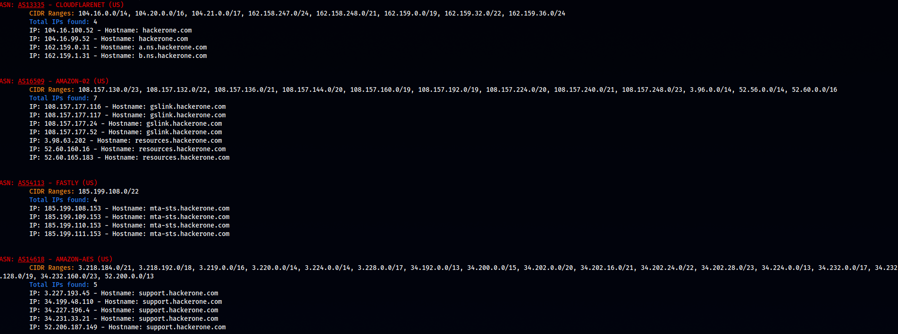

# ASN-Recon
The idea of having an ordered map it came to me from an old tool that I was using [ksubdomain](https://github.com/knownsec/ksubdomain) from **knownsec** (scary fast) that had an interesting feature to summarize the output of the scan and map all the founded domains in the ASN structures, but unfortunately the tool is not manteined anymore, there is the new version from [BoyHack](https://github.com/boy-hack/ksubdomain) that is still impressive but doesn't have some features, for example the `-summary` tag.

So I decide to implement a short Python script that let me see clearly the data as I was used to.
Organize them in a Database is obviously a MUST and something that have to be done during a PT but here im just talking about quickly visualize data to understand them better.

## Usage

```shell
# Subdomains mapped across each ASN Zone and provider
subfinder -silent -d hackerone.com | dnsx -silent -a -resp-only | asnmap -json -silent | jq -n '.TARGET |= [inputs]' > target.json

# Then create a hostfile
subfinder -silent -d hackerone.com | dnsx -silent -a -resp -json | jq 'with_entries(select(.key | in({"host":1, "a":1})))' | jq -n '[inputs]' > hostsfile.json

# Parse them with the script
python ASN-recon.py target.json hostsfile.json
```

<p align="center">

</p>
<p align="center">
Output example of the script
</p>
